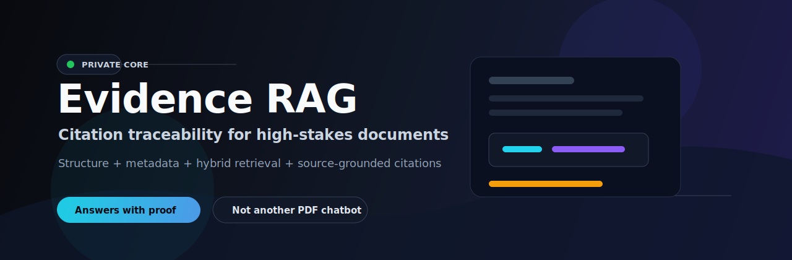
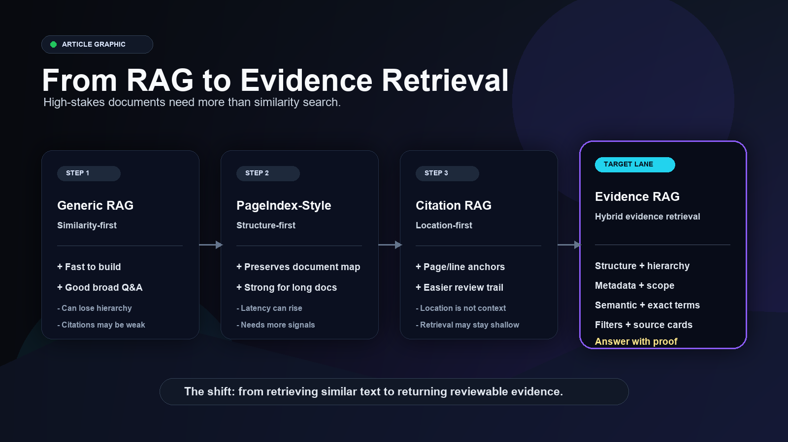
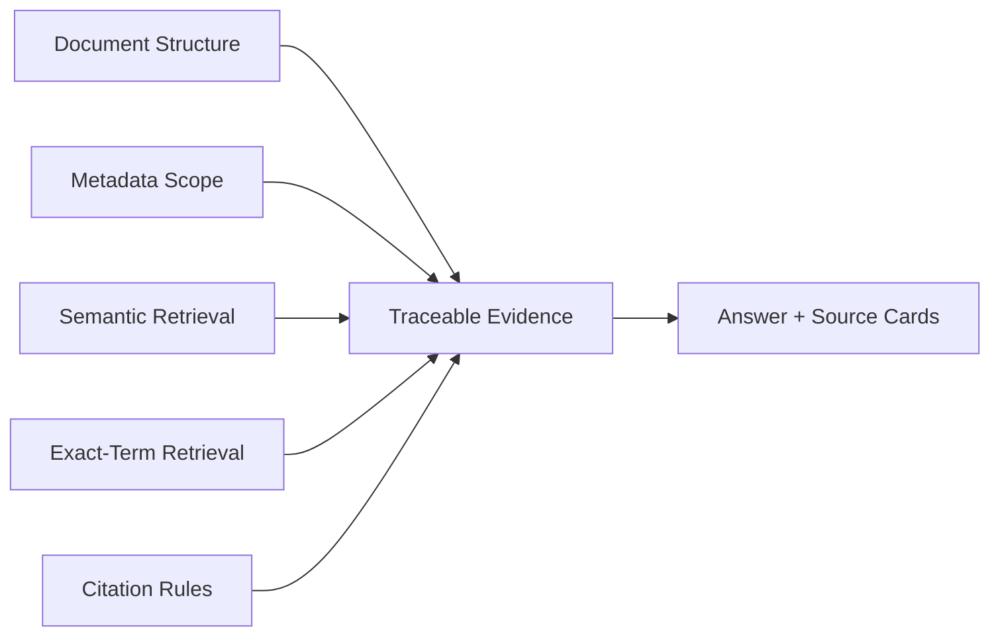
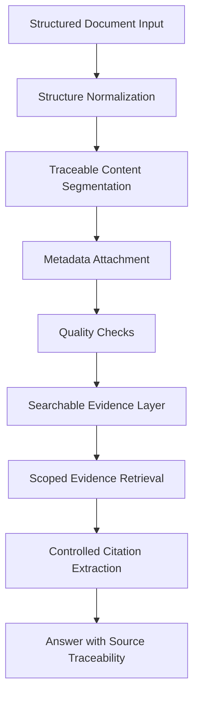

# Evidence RAG

**Citation traceability for high-stakes documents. Built around a private hybrid evidence retrieval core.**


> Generic RAG finds similar text. Evidence RAG is designed to return traceable support.

This repository is a **public product and architecture showcase** for a private citation-critical RAG engine. It explains the problem, shows the public demo, and describes the approach at a safe level without exposing the proprietary implementation.

No client documents, restricted examples, prompts, model choices, ranking logic, raw nodes, or indexing schemas are included.

---

## Quick Scan

| What it is | What it is not |
|---|---|
| A product-facing showcase for a private evidence retrieval engine | An open-source RAG library |
| A demo of citation traceability over synthetic compliance content | A release of the private core implementation |
| A structure-aware, metadata-aware retrieval concept | A generic chat-with-PDF wrapper |
| A way to explain and validate the product direction | A benchmark claim or production SLA |

---

## The Problem

Most document AI demos optimize for a fluent answer.

High-stakes document workflows need something stricter:

| In simple document chat | In regulated document work |
|---|---|
| A good summary may be enough | The exact source text matters |
| Similar chunks can be useful | The right section and scope matter |
| A broad citation may pass | Page, section, and subsection matter |
| Generic retrieval can work | Metadata and authority matter |

If the system loses structure, the answer can sound correct while still being unsafe to trust.

---

## Product Contract

Every useful answer should make review easier.

| Evidence field | Why it matters |
|---|---|
| Source document | Confirms the answer came from the right file |
| Section and subsection | Preserves document hierarchy |
| Page | Gives a stable review anchor |
| Exact cited passage | Keeps the answer grounded |
| Applied filters | Shows scope and retrieval boundaries |

The goal is not to replace expert review. The goal is to make expert review faster, more traceable, and less manual.

---

## Demo Preview

The public demo uses **synthetic banking and compliance content**.

| Pipeline observability | Citation chat |
|---|---|
|  |  |

| Answer-focused view |
|---|
|  |

---

## Retrieval Approach Comparison



| Approach | Main idea | Strength | Common gap |
|---|---|---|---|
| Generic vector RAG | Retrieve semantically similar chunks | Fast to build and useful for broad Q&A | Can lose hierarchy, exact wording, and scope |
| PageIndex-style retrieval | Navigate document structure instead of flat chunks | Strong for long structured documents | Structure alone may not cover exact terms, filtering, or corpus scale |
| Location-first citation RAG | Store and return page, line, or paragraph anchors | Makes citations visible | Location is not enough without hierarchy and context |
| Evidence RAG | Combine structure, metadata, retrieval signals, filters, and citation extraction | Built for traceable answers in high-stakes documents | Requires domain-specific validation and careful configuration |

## Capability Matrix

Legend: Yes = native strength, Partial = possible but not always central, No = usually missing or weak in the default pattern.

| Capability | Generic RAG | PageIndex-style | Location-first Citation RAG | Evidence RAG |
|---|---:|---:|---:|---:|
| Semantic similarity search | Yes | Partial | Yes | Yes |
| Exact-term / keyword retrieval | Partial | Partial | Partial | Yes |
| Document hierarchy preserved | No | Yes | Partial | Yes |
| Section and subsection awareness | Partial | Yes | Partial | Yes |
| Page-level traceability | Partial | Partial | Yes | Yes |
| Source coordinates visible | Partial | Partial | Yes | Yes |
| Metadata before retrieval | Partial | Partial | Partial | Yes |
| Filter by document type, authority, region, or domain | Partial | Partial | Partial | Yes |
| Parent context available during answer | Partial | Yes | Partial | Yes |
| Works across many scoped documents | Partial | Partial | Partial | Designed for it |
| Handles exact regulatory / policy wording | Partial | Partial | Partial | Yes |
| Citation treated as output contract | No | Partial | Yes | Yes |
| Answer linked to reviewable evidence | Partial | Partial | Yes | Yes |
| Public demo without private core exposure | Not specific | Not specific | Not specific | Yes |

```text
Generic RAG                 -> Similarity-first
PageIndex-style retrieval   -> Structure-first
Location-first citation RAG -> Coordinate-first
Evidence RAG                -> Evidence-first hybrid retrieval
```

---

## Hybrid Evidence Retrieval

Evidence RAG uses the hybrid direction as the product thesis:



Why hybrid?

| Signal | What it protects |
|---|---|
| Structure | Section hierarchy, parent context, document meaning |
| Metadata | Authority, document type, region, domain, version |
| Semantic retrieval | User intent and paraphrased questions |
| Exact-term retrieval | Acronyms, control names, legal phrases, technical terms |
| Filters | Wrong-document and wrong-scope retrieval |
| Citation extraction | Verifiable final output |

---

## Public-Safe Architecture



The showcase UI exposes sanitized observability only:

| Stage | Public signal |
|---|---|
| Load | Document received |
| Normalize | Structure prepared |
| Segment | Content organized into evidence units |
| Enrich | Metadata attached |
| Validate | Quality checks completed |
| Index | Search layer ready |
| Cite | Citation engine ready |

Private internals stay private.

---

## Example: Basic RAG vs Evidence RAG

### Query

```text
What controls are required before onboarding a high-risk vendor?
```

### Basic RAG-style answer

```text
High-risk vendors require enhanced due diligence, approval, and documented control checks before onboarding.
```

### Evidence RAG-style answer

```text
Section 5.2 "Enhanced Due Diligence",
Subsection 5.2.1 "High-Risk Vendor Review", Page 31

"High-risk vendors must not be onboarded until enhanced due diligence is completed, documented, and approved by the designated control owner."

Section 5.2 "Enhanced Due Diligence",
Subsection 5.2.2 "Required Control Evidence", Page 32

- The vendor risk assessment must identify service criticality, data access level, geographic exposure, and dependency on subcontractors.
- The business owner must obtain evidence of information security controls, financial stability, business continuity capability, and sanctions screening.
- Legal and compliance review must be completed before contract execution when the vendor handles confidential customer or transaction data.
```

---

## More Synthetic Examples

<details>
<summary><strong>Policy exception approval</strong></summary>

**Question**

```text
Who can approve a policy exception?
```

**Basic answer**

```text
Policy exceptions usually need approval from compliance or a risk owner.
```

**Evidence answer**

```text
Section 7.4 "Policy Exceptions",
Subsection 7.4.2 "Approval Authority", Page 58

"Exceptions to mandatory controls must be approved by the accountable business owner, the control owner, and Compliance before the exception becomes active."
```

</details>

<details>
<summary><strong>Ongoing monitoring frequency</strong></summary>

**Question**

```text
How often should high-risk vendors be reviewed?
```

**Basic answer**

```text
High-risk vendors should be reviewed regularly, typically once per year.
```

**Evidence answer**

```text
Section 6.1 "Ongoing Monitoring",
Subsection 6.1.3 "Periodic Review", Page 44

"High-risk vendors must be reviewed at least annually, or sooner when a material service, control environment, or ownership change is identified."
```

</details>

---

## Where This Fits

| Domain | Why evidence traceability matters |
|---|---|
| Banking and compliance | Controls, policies, obligations, audit readiness |
| Legal and contracts | Clauses, exceptions, definitions, governing language |
| Pharma and clinical | Protocols, submissions, safety language, review trails |
| Insurance | Policy wording, exclusions, claims rules |
| Vendor risk | Due diligence, monitoring, control evidence |
| Audit | Source-backed findings and review documentation |
| Technical standards | Exact requirements and section references |

---

## Current Status

| Area | Status |
|---|---|
| Private core pipeline | Working MVP |
| Citation extraction | Working MVP |
| Filtered retrieval | Working MVP |
| Demo API and UI | Working showcase layer |
| Public repository | Product brief and screenshots |
| Client data | Not included |
| Production deployment | Private pilot discussion |

---

## What Stays Private

| Private asset | Reason |
|---|---|
| Core engine source code | Product IP |
| Prompts and extraction rules | Retrieval and citation quality |
| Model choices | Implementation detail |
| Ranking and retrieval internals | Competitive advantage |
| Indexing schema and raw nodes | Pipeline detail |
| Client documents | Confidentiality |
| Evaluation data | Private validation material |

---

## Contact

For private demos, pilots, or domain-specific deployments:

**LinkedIn:** [Hassan Abdullah](https://www.linkedin.com/in/hassan--abdullah)
