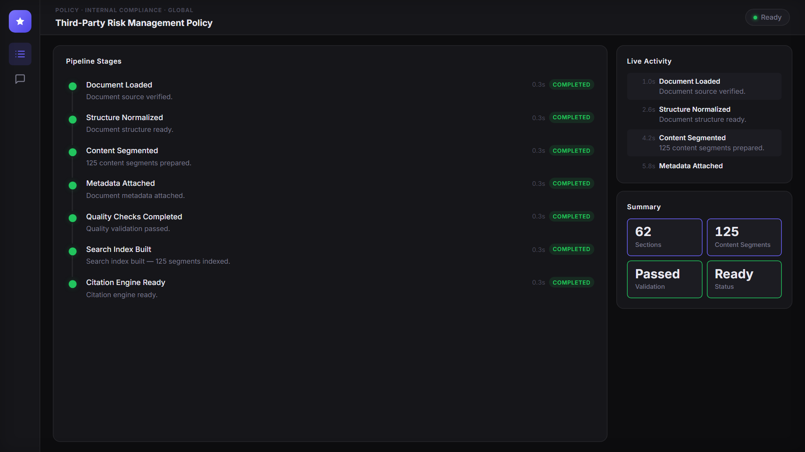
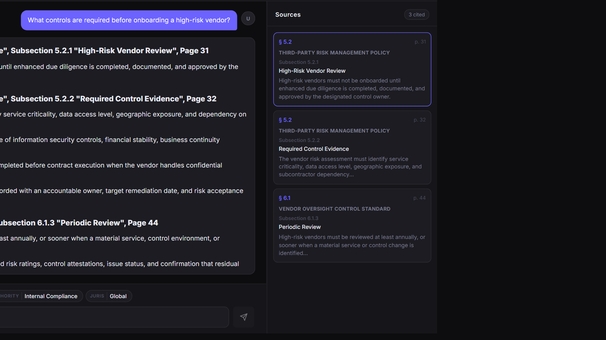
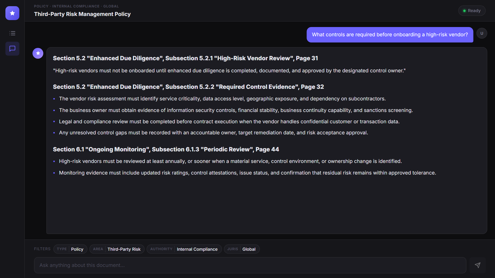

# Citation-Critical RAG

**A private core engine for answers that need evidence, not just confidence.**


Most AI document systems can produce a fluent answer.

Citation-critical work needs something harder: the exact supporting text, from the exact document location, with enough traceability for an auditor, reviewer, counsel, regulator, or risk team to verify it.

This project is a private core engine for regulated-document question answering where citations are evidence, not decoration.

> Public note: this repository is intentionally a showcase and architecture overview. The core implementation, client data, prompts, retrieval internals, model choices, indexing schema, and production pipeline details are private.

---

## Demo Preview

The public demo uses synthetic banking/compliance content so the product can be shown without exposing restricted client material.

### Pipeline observability



### Citation answer with source traceability



### Answer-focused view



---

## The Problem

In regulated domains, a citation is not a footnote. It is the evidence trail.

Generic RAG systems often fail in ways that look acceptable in a demo but break down under review:

- The answer is paraphrased instead of extracted.
- The cited source is too broad to verify quickly.
- Page, section, subsection, and document lineage are incomplete.
- Retrieved fragments lose the surrounding document structure.
- The system answers even when the exact support is not present.

That is risky for compliance, legal, audit, policy, procurement, financial services, pharma, defense, and other document-heavy workflows where the source text is the authority.

---

## What This Engine Is Built To Do

Citation-Critical RAG is designed to turn long structured documents into a queryable evidence layer.

It focuses on:

- Preserving document hierarchy instead of flattening everything into plain text.
- Keeping page, section, subsection, title, document, authority, and domain metadata attached to evidence.
- Retrieving the most relevant evidence units with their surrounding context.
- Returning verbatim supporting text where possible.
- Showing source cards that make review fast and inspectable.
- Avoiding unsupported answers when the source evidence is not available.

The goal is not to replace expert review. The goal is to make expert review faster, more traceable, and less dependent on manually hunting through long documents.

---

## What Makes This Different From A Basic RAG Demo

Basic RAG usually treats a document as text to search.

This engine treats a document as a structured source of authority.

| Requirement | Basic document chat | Citation-critical engine |
|---|---|---|
| Document structure | Often flattened | Preserved as part of retrieval context |
| Citations | Often decorative | Treated as the primary output contract |
| Answers | Often summarized | Designed around verbatim evidence |
| Source location | Sometimes broad | Section, subsection, page, document |
| Review workflow | User must verify manually | Evidence is surfaced beside the answer |
| Domain fit | Generic | Configured per regulated corpus |

---

## Public-Safe Architecture

The full implementation is private, but the operating shape is simple to understand:

```text
Structured document
        |
        v
Structure normalization
        |
        v
Traceable content segmentation
        |
        v
Metadata attachment and quality checks
        |
        v
Searchable evidence index
        |
        v
Filtered evidence retrieval
        |
        v
Verbatim citation extraction
        |
        v
Answer with source cards
```

The public observability layer exposes high-level progress only: loaded, normalized, segmented, metadata attached, quality checks completed, search index ready, and citation engine ready.

It intentionally does not expose proprietary mechanics.

---

## Example Outputs

The examples below use synthetic compliance text. They are meant to show the output contract: not "probably correct", but traceable to an exact document location.

### Example 1: Vendor onboarding

```text
What controls are required before onboarding a high-risk vendor?
```

Generic AI / basic RAG might return:

```text
High-risk vendors require enhanced due diligence, approval, and documented control checks before onboarding.
```

Citation-Critical RAG returns:

```text
Section 5.2 "Enhanced Due Diligence",
Subsection 5.2.1 "High-Risk Vendor Review", Page 31

"High-risk vendors must not be onboarded until enhanced due diligence is completed, documented, and approved by the designated control owner."

Section 5.2 "Enhanced Due Diligence",
Subsection 5.2.2 "Required Control Evidence", Page 32

- The vendor risk assessment must identify service criticality, data access level, geographic exposure, and dependency on subcontractors.
- The business owner must obtain evidence of information security controls, financial stability, business continuity capability, and sanctions screening.
- Legal and compliance review must be completed before contract execution when the vendor handles confidential customer or transaction data.
- Any unresolved control gaps must be recorded with an accountable owner, target remediation date, and risk acceptance approval.
```

### Example 2: Policy exceptions

```text
Who can approve a policy exception?
```

Generic AI / basic RAG might return:

```text
Policy exceptions usually need approval from compliance or a risk owner.
```

Citation-Critical RAG returns:

```text
Section 7.4 "Policy Exceptions",
Subsection 7.4.2 "Approval Authority", Page 58

"Exceptions to mandatory controls must be approved by the accountable business owner, the control owner, and Compliance before the exception becomes active."

Section 7.4 "Policy Exceptions",
Subsection 7.4.3 "Exception Register", Page 59

"Each approved exception must include a documented business justification, expiration date, compensating control, and named accountable owner."
```

### Example 3: Evidence review

```text
How often should high-risk vendors be reviewed?
```

Generic AI / basic RAG might return:

```text
High-risk vendors should be reviewed regularly, typically once per year.
```

Citation-Critical RAG returns:

```text
Section 6.1 "Ongoing Monitoring",
Subsection 6.1.3 "Periodic Review", Page 44

"High-risk vendors must be reviewed at least annually, or sooner when a material service, control environment, or ownership change is identified."

Section 6.1 "Ongoing Monitoring",
Subsection 6.1.4 "Monitoring Evidence", Page 45

"Monitoring evidence must include updated risk ratings, control attestations, issue status, and confirmation that residual risk remains within approved tolerance."
```

This is the behavior the engine is designed around: exact location, exact source language, and evidence that can be reviewed.

---

## Where This Fits

This pattern is useful anywhere documents are the source of truth:

- Financial compliance and policy review
- Vendor risk and third-party risk management
- Legal and contract review
- Pharmaceutical and clinical documentation
- Internal audit and control evidence
- Defense, procurement, and regulated operations
- Technical regulatory review

The architecture is domain-adaptable, but not magic. Each serious deployment needs corpus-specific metadata, parsing assumptions, evaluation, and validation.

---

## Current Status

This is a working private MVP, not a public open-source library.

| Area | Status |
|---|---|
| Core document pipeline | Working private implementation |
| Citation extraction | Working private implementation |
| Filtered retrieval | Working private implementation |
| Demo API and UI | Working showcase layer |
| Public repo | Architecture, screenshots, and positioning only |
| Production rollout | Private pilot / deployment discussion |

No client documents are included in this repository.

---

## What Is Not Public

The following are intentionally not published:

- Core engine source code
- Client documents or restricted examples
- Retrieval algorithms and ranking internals
- Model choices and prompt logic
- Indexing schema and raw document nodes
- Evaluation data and deployment configuration

This protects the implementation while still showing what the system is built to achieve.

---

## Contact

For private demos, pilots, or domain-specific deployments:

**LinkedIn:** [Hassan Abdullah](https://www.linkedin.com/in/hassan--abdullah)
